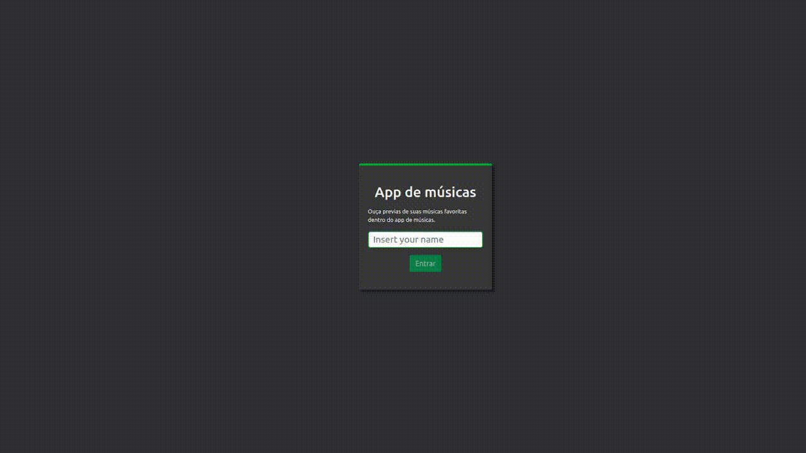

# TrezeTunes 🎵



Bem vindo ao TrezeTunes. Uma aplicação capaz de procurar, reproduzir e favoritar suas musicas e albuns favoritos. *A aplicação foi construida durante o modulo de front-end da [Trybe](https://www.betrybe.com/)

### Ajustes e melhorias

O projeto ainda está em desenvolvimento e as próximas atualizações serão voltadas nas seguintes tarefas:

- [x] Fazer login
- [x] Pesquisar por uma banda ou artista
- [x] Listar os álbuns disponíveis dessa banda ou artista
- [x] Visualizar as músicas de um álbum selecionado;
- [x] Reproduzir uma prévia das músicas deste álbum;
- [x] Favoritar e desfavoritar músicas;
- [ ] Ver a lista de músicas favoritas;
- [ ] Ver o perfil da pessoa logada;
- [ ] Editar o perfil da pessoa logada;

## 🚀 Começando

Essas instruções permitirão que você obtenha uma cópia do projeto em operação na sua máquina local para fins de desenvolvimento e teste.

### Pré-requisitos

Antes de começar, você vai precisar ter instalado em sua máquina as seguintes ferramentas:
[Git](https://git-scm.com), [Node.js](https://nodejs.org/en/). 
Além disto é bom ter um editor para trabalhar com o código como [VSCode](https://code.visualstudio.com/)


```bash
# Clone este repositório
$ git clone git@github.com:PedroFonseca13/app-music.git
# Acesse a pasta do projeto no seu terminal/cmd
$ cd app-music
# Instale as dependências
$ npm install ou yarn install
# Execute a aplicação em modo de desenvolvimento
$ npm run start ou yarn start
# A aplicação será aberta na porta:3000 - acesse http://localhost:3000
```

## 🛠️ Construído com


---
⌨️ com 💚 por [Pedro Fonseca](https://github.com/PedroFonseca13) 😊🌱
